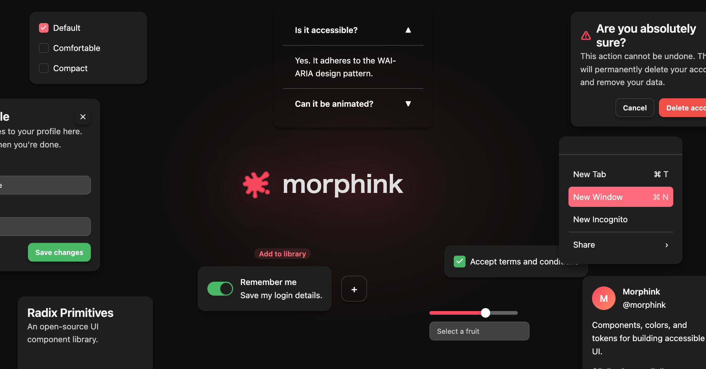

[English](./README.md) | [日本語](./README.ja.md)

# morphink

<p align="center">
  
</p>

Vue 3 のためのデザインシステムボイラープレート — トークンパイプライン、レイヤードコンポーネントアーキテクチャ、Storybook をフォークして使える形で提供。

> **なぜ morphink？** 設計思想の詳細は [CONCEPT.ja.md](./CONCEPT.ja.md) を参照。

## クイックスタート

```bash
pnpm install
pnpm run build
pnpm run dev:docs
```

Storybook: `http://localhost:6006/`

## アーキテクチャ

```
Tokens Studio
  → packages/tokens/tokens/*.json (alias / semantic / semantic-dark)
  → Style Dictionary (ビルド)
  → packages/tokens/dist (css / json / ts)
  → packages/ui/src/styles/tokens.css (import)
  → Tailwind コンパイル → packages/ui/dist/ui.css
  → Storybook
```

## パッケージ構成

| パッケージ | 説明 |
|-----------|------|
| `packages/tokens` | デザイントークンのソース（Tokens Studio）と Style Dictionary ビルド |
| `packages/ui` | Vue 3 UI コンポーネント — Reka UI ヘッドレスプリミティブ + CVA スタイリング |
| `packages/docs` | コンポーネントカタログとガイドラインの Storybook |

## カスタマイズ

1. `packages/tokens/tokens/` のトークン値をブランドカラーとスケールに差し替え
2. 再ビルド: `pnpm run build`
3. デザインシステムの準備完了

## 利用形態

### morphink の取り込み方

1. **テンプレートからフォーク** — GitHub で「Use this template」をクリックして独立リポジトリを作成。メインの想定ルート。npm 公開して自社 DS として配布することも可能。
2. **モノレポ組み込み** — 既存プロジェクトの workspace に packages/tokens と packages/ui を追加。
3. **フラット組み込み** — 既存プロジェクトの src 配下に展開（モノレポ化不要）。

### DS コンシューマのユーティリティ選択

| プロジェクトの状況 | 使うもの |
|---|---|
| Tailwind を導入できない | `utilities.css`（mi:\* クラス）|
| Tailwind がある | `tailwind-theme.css`（Tailwind テーマプリセット）|

どちらも同じトークンを参照する。入口が違うだけ。

## ドキュメント

- [CONCEPT.ja.md](./CONCEPT.ja.md) — アーキテクチャ思想と設計判断
- [docs/architecture.ja.md](./docs/architecture.ja.md) — 技術アーキテクチャとデータフロー
- [docs/workflows.ja.md](./docs/workflows.ja.md) — 開発ワークフロー

## ライセンス

[MIT](./LICENSE)
